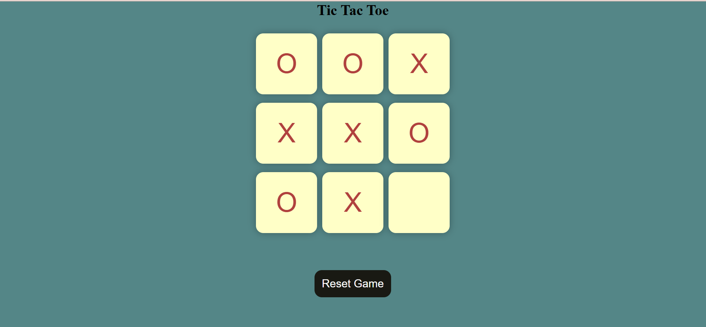

# Tic-Tac-Toe


## 📝 Project Description

This is a simple, fully functional **Tic Tac Toe** game built using **HTML**, **CSS**, and **JavaScript**.  
Players take turns marking a square with either "X" or "O" until one player wins by aligning three marks in a row horizontally, vertically, or diagonally — or until all squares are filled (draw).

---
## 📂 Project Structure

```
Tic-Tac-Toe/
├── index.html     # Structure of the game
├── style.css      # Styling for the game
├── script.js      # Game logic and interactions
├── Homepage.png   # Screenshot of the game
```
---

## ⚙️ Features

- Classic **3x3 Tic Tac Toe** grid
- Two-player turn-based gameplay (O and X)
- **Winner detection** for all possible win conditions
- **Reset Game** button to restart the match anytime
- **New Game** button after a win to start a fresh match
- Responsive layout for different devices
- Smooth and simple UI with neat effects

---

## 🛠️ Technologies Used

- **HTML5** – To create the structure of the game.
- **CSS3** – For styling and responsive layout.
- **JavaScript (Vanilla JS)** – To add game functionality and logic.

---

## 🎯 Game Rules

- The game is played on a 3x3 grid.
- Player 1 is **"O"**, Player 2 is **"X"**.
- Players take turns putting their marks in empty squares.
- The first player to get three of their marks in a row (up, down, across, or diagonally) is the winner.
- If all squares are full and no player has three in a row, the game is declared a draw.

---
## 📢 Notes

- Basic error handling is included.
- The game alerts the winner with a congratulatory message.
- You can **Reset** the game at any time or start a **New Game** after a win.

---
## 👨‍💻 Author

- Hariom Pawar
---
